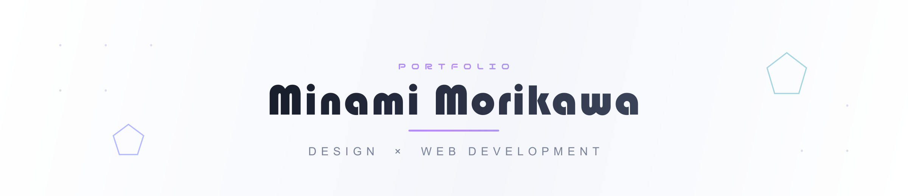

デザインとWeb開発をやっています。

---

<table align="center"><tr><td valign="top" width="50%">

### 🎨 Design

  

</td><td valign="top" width="50%">

### 💻 Development

  

</td></tr></table>

---

### 🚀 Projects

| プロジェクト | 説明 |
|---|---|
| [オンギャーマネジメント](https://github.com/mori-foy/ongya) | 6秒ルールで"オンギャー"を止めろ！迷路タイムアタックゲーム |
| [川柳now](https://github.com/mori-foy/senryunow) | 即興で五七五を詠み、友達と共有するSNS |
| [YOUR AI](https://github.com/mori-foy/yourai) | 自分の選択をAIとの対話で納得するサービス |
| [宝石16タイプ診断](https://github.com/mori-foy/16type) | 16の問いから宝石タイプを診断 |
| [Hack-1](https://github.com/mori-foy/Hack-1) | Hack-1グランプリ 2026 出場作品 |

---

